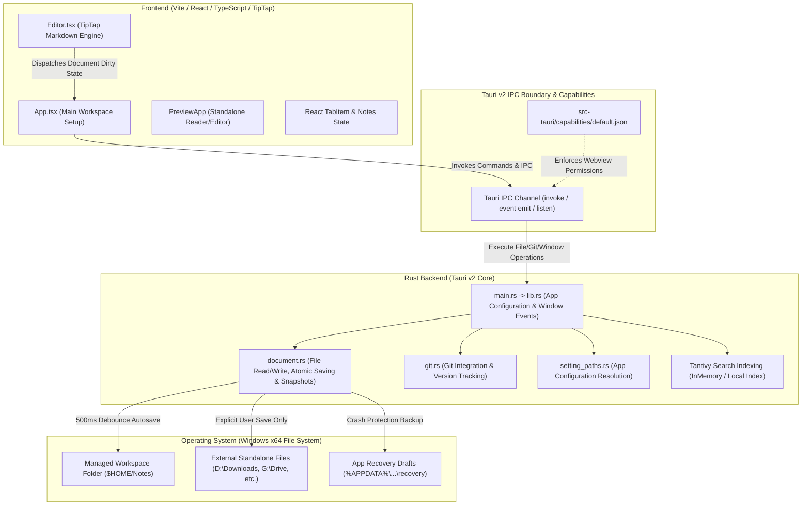
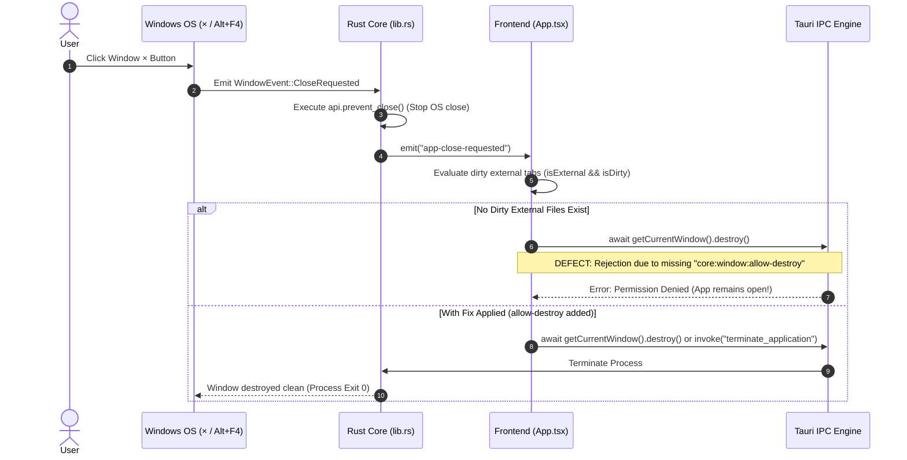

# Comprehensive Defect Report, Handoff Package & Project Structure Graph

## 1. Executive Summary: Why the Window Close Button Fails

Despite previous attempts to adjust dirty-tab logic and move window close interception between JavaScript and Rust, **clicking the window × button or pressing Alt+F4 continues to fail, leaving the application impossible to close normally.**

### The Exact Root Cause
The bug is **not** in React state timing or dirty-tab filtering anymore. It is a **Tauri v2 IPC Security Permission Denial**.

1. **The Tauri v2 Shutdown Engine:** 
   When using `getCurrentWindow().onCloseRequested(...)` in Tauri v2 JavaScript, Tauri intercepts the native window close event at the OS level. If your handler finishes without calling `event.preventDefault()`, Tauri automatically executes `await this.destroy()` (see `@tauri-apps/api/window.js` lines 1622–1630).
   Similarly, in our latest v1.0.8 architecture, our Rust code calls `api.prevent_close()` on `WindowEvent::CloseRequested` and emits `"app-close-requested"` to the frontend, where `App.tsx` manually executes `await getCurrentWindow().destroy()`.

2. **The Fatal Capability Missing Exception:**
   In Tauri v2, calling `.destroy()` on a webview window is a privileged IPC operation distinct from `.close()`. In our application's capability configuration ([default.json](file:///d:/Apps/markdown-editor/src-tauri/capabilities/default.json#L6-L19)), the permission `"core:window:allow-close"` is granted, **but `"core:window:allow-destroy"` is completely absent**.

3. **The Resulting Failure Loop:**
   - User clicks **×** or presses **Alt+F4**.
   - The OS close event is intercepted and cancelled (`api.prevent_close()` or JS event interception).
   - The frontend evaluates the tabs, concludes there are no dirty external files, and invokes `getCurrentWindow().destroy()`.
   - **The Tauri IPC security layer intercepts the call and rejects it with an access denied error** because `"core:window:allow-destroy"` is missing from `capabilities/default.json`.
   - The window remains trapped open indefinitely.

---

## 2. Definitive Remediation Plan (How to Fix)

To solve this permanently and cleanly in the next build, implement the following three precise adjustments:

### Step A: Add Destroy Permission to Tauri Capabilities
Modify [default.json](file:///d:/Apps/markdown-editor/src-tauri/capabilities/default.json) to explicitly grant window destruction permission to the webview:

```diff
  "permissions": [
    "core:default",
    "core:window:allow-close",
+   "core:window:allow-destroy",
    "core:window:allow-start-dragging",
    "core:window:allow-set-focus",
    "core:webview:allow-print",
```

### Step B: Add an Unconditional Rust Exit Command (Fail-Safe)
To guarantee the app can never get stuck in an uncloseable loop due to frontend IPC limitations, export a native backend termination command in [lib.rs](file:///d:/Apps/markdown-editor/src-tauri/src/lib.rs):

```rust
#[tauri::command]
pub fn terminate_application(app: tauri::AppHandle) {
    app.exit(0);
}
```
*Remember to register `terminate_application` in `.invoke_handler(tauri::generate_handler![...])` around line 4253.*

### Step C: Update Frontend Close Logic in App.tsx
In [App.tsx](file:///d:/Apps/markdown-editor/src/App.tsx#L180-L220), call either `destroy()` (now properly authorized) or invoke the foolproof backend exit command:

```diff
- await getCurrentWindow().destroy();
+ // Use native IPC destroy now that allow-destroy is granted, with Rust exit backup:
+ try {
+   await getCurrentWindow().destroy();
+ } catch (destroyErr) {
+   console.warn("destroy failed, invoking backend termination", destroyErr);
+   const { invoke } = await import("@tauri-apps/api/core");
+   await invoke("terminate_application");
+ }
```

---

## 3. Project Structure & Code Review Architecture Graph

Below is the structured architectural graph illustrating the Tauri v2 boundaries, document storage flows, and event interception pipelines for the Markdown Editor.

### A. System Boundary & IPC Communication Graph



---

### B. The Window Shutdown Event Pipeline (Current vs Target State)



---

## 4. Architectural Domain Separation (Reference Handoff Data)

This project strictly maintains two distinct operational workflows based on document origination to prevent background lock errors (`os error 5` and validation race conditions):

| Operational Axis | Managed Workspace Notes | External Standalone Files |
| :--- | :--- | :--- |
| **Storage Location** | Inside application base folder (`notes_folder`) | Outside folder (e.g., Downloads, USB drives, Network) |
| **Background Autosave** | **ENABLED** (Debounced 500ms timer writes to disk) | **DISABLED** (Zero background writes to source file) |
| **Dirty Tracking (`isDirty`)** | Reset automatically after background autosave | Remains `true` until manual Save (`Ctrl+S` / Save As) |
| **Window Close Behavior** | Never halts application shutdown | Halts shutdown & presents Save / Discard modal |
| **Crash Protection** | Saved directly to target note file | Saved silently to `%APPDATA%` recovery drafts |

---

## 5. Engineer Handoff Checklist & Action Plan

For an engineer or LLM coding auditor picking up this task, execute the following verified step-by-step checklist:

- [ ] 1. Open [default.json](file:///d:/Apps/markdown-editor/src-tauri/capabilities/default.json) and insert `"core:window:allow-destroy"` into the `permissions` array.
- [ ] 2. Open [lib.rs](file:///d:/Apps/markdown-editor/src-tauri/src/lib.rs) and implement the native `terminate_application` helper command as described in Step 2B above.
- [ ] 3. Register `terminate_application` inside `tauri::generate_handler![...]` in [lib.rs](file:///d:/Apps/markdown-editor/src-tauri/src/lib.rs).
- [ ] 4. Update the `"app-close-requested"` event listener in [App.tsx](file:///d:/Apps/markdown-editor/src/App.tsx#L180-L215) to use the try/catch fallback invoking `terminate_application` if webview destruction fails.
- [ ] 5. Run `npx tauri build` to compile the corrected binaries and test closing the application via the desktop **×** icon.
- [ ] 6. Publish the final verified release to GitHub repository `alimozaffari-stack/markdown-editor`.
